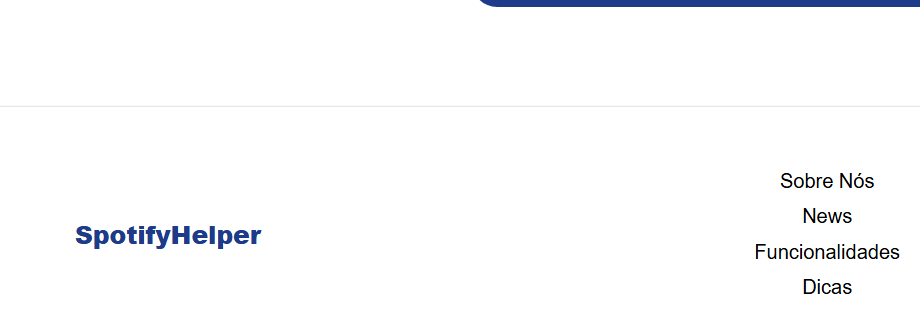

## SpotifyHelper
Aplicação web desenvolvida como parte de um curso auto-instrucional, criada para o teste técnico de front-end.

O projeto simula uma plataforma educacional, onde o usuário realiza atividades em sequência, recebe feedback imediato e tem seu progresso armazenado.

## ✨ Processo Criativo
Para iniciar o projeto, busquei referências em plataformas educacionais com propostas semelhantes, como Fundação Bradesco, Khan Academy e Canvas, além de explorar inspirações de design no Pinterest. O objetivo principal foi manter o conteúdo direto e a aplicação simples, garantindo uma navegação intuitiva e usabilidade acessível para cumprir os requisitos do desafio.

## ⚙️ Decisões Técnicas
Angular 17: framework robusto para lidar com componentes, rotas e formulários de maneira estruturada.
Typescript: tipagem estática para maior segurança e clareza no desenvolvimento.
LocalStorage: persistência simples do progresso do usuário e tentativas sem depender de backend.
RxJS + HttpClient: para consumir dados da API do Unsplash.
SCSS: melhor organização e reaproveitamento de estilos.
API Unsplash: geração dinâmica de imagens de acordo com o resultado do usuário, deixando a experiência mais imersiva.

## 🚀 Funcionalidades
✅ Progressão controlada.
✅ Persistência de dados no navegador.
✅ Feedback dinâmico a cada resposta.
✅ Bloqueio de páginas após término das atividades.
✅ Tema claro e escuro.
✅ Página de resultado final com cálculo de nota.
✅ Limite de 3 tentativas por atividade.
✅ Exercícios com múltipla escolha, escolha única e combobox.

## 📱 Outros Requisitos
Mobile-first.
Responsividade.
Otimização de imagens.

## 🥚 Easter Egg
Testou a aplicação e as informações ficaram salvas?
Clique no botão com o nome do projeto dentro do footer para resetar e testar novamente.

## 🤖 IA
Durante o desenvolvimento, utilizei inteligência artificial como apoio para criação de conteúdos e esclarecimento de dúvidas específicas.